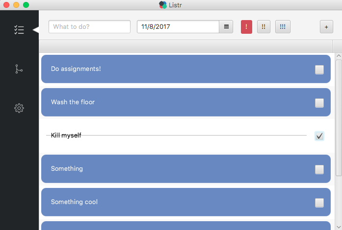

# Listr
*The modern todo list application with a simple design.*  

## Main Features
There are 3 main screens for this application:
1. List view 
	- Quickly add a todo item to the list
	- Shows a list of todo item (sorted by date ascending)
	- Check and uncheck a todo item
2. Timeline
	- Enables the user to visualize what todo next
	- Shows a horizontal scrolling screen with circles, each circle indicates a todo item
	- The first circle always shows the first item on today's list
	- The second circle shows the next day, etc.
3. Settings
	- Able to choose from a list of selected themes.

Group Report
-----------------------------
